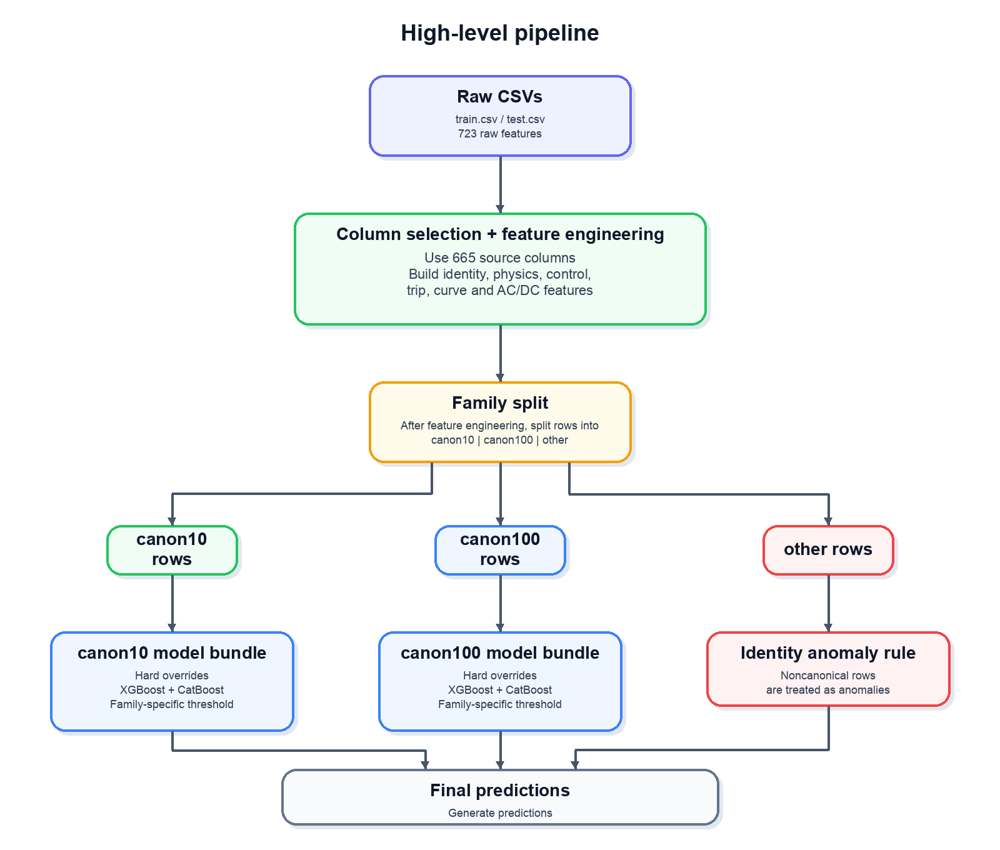

# Anomaly Detection for DER Systems

This repository contains a reproducible local version of my work for Kaggle's
**Cyber-Physical Anomaly Detection for DER Systems** competition. The goal is
to detect anomalous or compromised Distributed Energy Resource operating states
from structured simulator telemetry.

The repository is intentionally split into two complementary goals:

1. **Explain the problem and the solution** so the repository has clear meaning
   beyond "some code that runs".
2. **Provide a pinned, reproducible execution path** that recreates the final
   pipeline in a Kaggle-compatible Docker environment.

For deeper supporting material:

- [`docs/description.md`](docs/description.md) — verified dataset facts,
  schema structure, feature families, and competition notes
- [`docs/writeup.md`](docs/writeup.md) — full solution writeup and modeling
  rationale

## Competition overview

The competition asks for a binary classifier:

- `0` = normal / compliant operation
- `1` = anomalous / compromised operation

Ranking uses **F2 score**, so recall matters more than precision.

The dataset is large, structured, and derived from DERSec DER simulator
telemetry organized around SunSpec-style information-model blocks instead of
anonymous flat features.

### Local dataset snapshot

These repository assumptions match the verified local files described in
[`docs/description.md`](docs/description.md):

| File | Purpose | Rows | Columns |
|---|---|---:|---:|
| `data/train.csv` | Training data | 2,363,163 | 725 |
| `data/test.csv` | Inference data | 1,012,785 | 724 |
| `data/sample_submission.csv` | Submission format example | 100 | 2 |

Important structural facts:

- there are **723 raw feature columns**
- `train.csv` is `Id + 723 features + Label`
- `test.csv` is `Id + 723 features`
- the same **182 feature columns are entirely null** in both train and test
- the data is dominated by two canonical DER identity fingerprints, with a
  small non-canonical tail that is highly anomaly-enriched

## What this repository implements

At a high level, the solution:

- starts from the raw CSV exports
- selects a reduced set of informative source columns
- engineers identity, missingness, electrical-consistency, control, protection,
  curve, and AC/DC features
- splits rows into `canon10`, `canon100`, and `other` families based on a
  5-field device fingerprint
- trains family-specific model bundles for the two canonical families
- handles non-canonical rows as a strong anomaly bucket
- tunes thresholds directly for **F2**, rather than using a default `0.5`



The full modeling story, including hard overrides and family-specific
ensembling, is documented in [`docs/writeup.md`](docs/writeup.md).

## Repository layout

- `src/` — pipeline implementation and executable entrypoint (`src.main`)
- `docs/` — competition description notes and the full solution writeup
- `diagrams/` — figures used by the documentation
- `run_docker.sh` — canonical pinned local execution path
- `data/` — expected location for the local train/test CSVs
- `kaggle-working/` — host-side output directory for generated submissions

## How to run the code

The recommended way to run this repository is through the pinned Kaggle CPU
Docker image. That path matches the intended runtime assumptions much more
closely than a lightweight local Python environment.

### 1. Prepare the data

Place the competition files in `data/`:

- `data/train.csv`
- `data/test.csv`
- optionally `data/sample_submission.csv`

### 2. Build the wrapper image

```bash
docker build --platform linux/amd64 -t der-kaggle-cpu .
```

The wrapper image does not install extra Python dependencies. Instead, it pins
the exact Kaggle CPU base image, creates `/opt/der-uv-env` with
`--system-site-packages --without-pip`, and configures `uv` to reuse the
packages already present in the Kaggle image.

On Apple Silicon, keep `--platform linux/amd64` for both `docker build` and
`docker run`; the Kaggle CPU image is published for `linux/amd64`.

### 3. Run the pinned workflow

```bash
./run_docker.sh
```

That command is the canonical reproducible entrypoint for this repository.

The script:

- mounts the repo root at `/workspace`
- mounts `data/` at
  `/kaggle/input/competitions/cyber-physical-anomaly-detection-for-der-systems`
- mounts `kaggle-working/` at `/kaggle/working`
- runs `uv run python -m src.main` inside the container

### 4. Collect the output

The submission is written to:

```text
kaggle-working/submission.csv
```

## Runtime and reproducibility notes

- `run_docker.sh` is the canonical way to reproduce the final pipeline
- the executable entrypoint lives in `src/main.py` and is invoked as
  `python -m src.main`
- the Docker image is designed to mirror the Kaggle CPU environment, not to be
  a general-purpose development image

### Environment fingerprint

- Kaggle image: `gcr.io/kaggle-images/python:v168`
- Image digest:
  `sha256:02c72a7c98e5e0895056901d9c715d181cd30eae392491235dfea93e6d0de3ed`
- Kaggle `BUILD_DATE`: `20260319-213519`
- Kaggle `GIT_COMMIT`: `c292018b280631cbfe6f4f16fc6a84f2786b5f86`
- Python: `3.12.12`
- OS: `Ubuntu 22.04.5 LTS`

## References

- Kaggle competition overview:
  <https://www.kaggle.com/competitions/cyber-physical-anomaly-detection-for-der-systems/overview>
- Dataset and schema notes: [`docs/description.md`](docs/description.md)
- Full solution writeup: [`docs/writeup.md`](docs/writeup.md)
